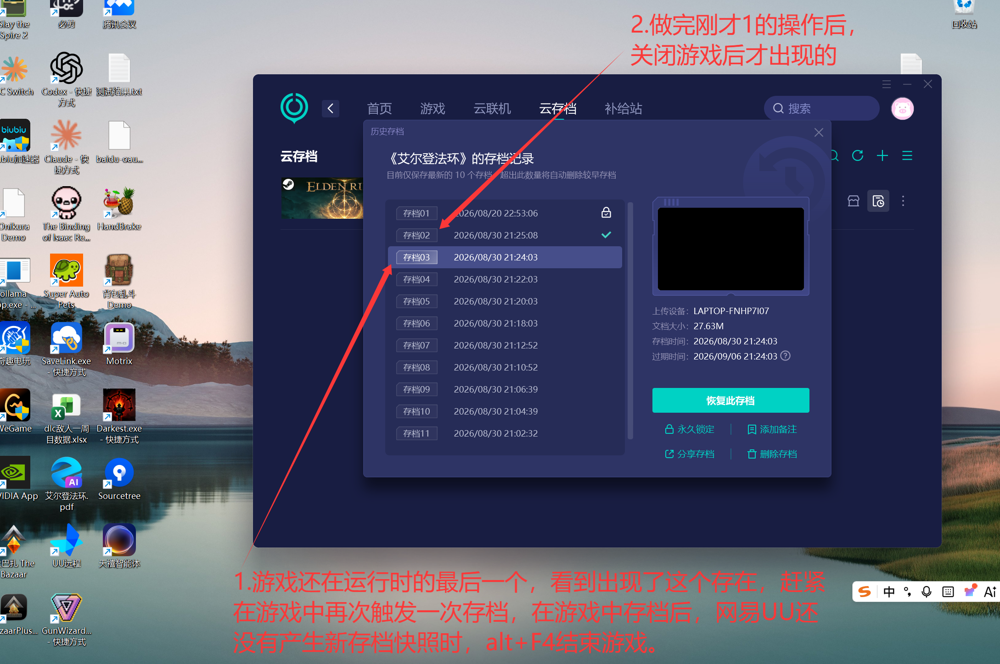

# SaveLink 游戏运行期短周期快照与退出收尾方案

## 版本历史

| 版本 | 修改人 | 时间 | 备注 |
| --- | --- | --- | --- |
| 1.0 | Codex | 2026-08-30 | 根据网易 UU《艾尔登法环》真实使用观察，记录未来短周期检查、内容去重和退出收尾方案 |

## 文档状态

本文记录一个**已经确定未来需要做、但当前暂不开发**的增强功能。

它不代表 SaveLink 当前已经具备两分钟游戏内检查或退出收尾能力，也不改变当前“启动后立即检查、之后每 10 分钟检查一次”的自动备份实现。正式开发前仍需完成本文中的竞品复现实验和 SaveLink 隔离验证。

## 目标

SaveLink 已经能够按照全局十分钟周期检查已配置游戏的存档变化。未来希望在用户实际游玩期间缩短存档保护窗口，并在游戏退出时补做最后一次检查：

```text
游戏运行期间
-> 以较短周期处理存档变化
-> 内容没有变化时不创建重复快照
-> 内容发生变化时创建并上传自动快照

游戏退出
-> 等待存档写入稳定
-> 立即执行最终检查
-> 补上尚未等到下一轮周期的最后一次存档变化
```

这个功能的核心价值不是把快照数量简单变多，而是缩短以下风险窗口：

- 用户在两次十分钟检查之间完成关键进度后游戏崩溃。
- 用户保存后很快退出，SaveLink 尚未进入下一次全局检查。
- 游戏退出时才刷新或关闭存档文件句柄，运行期间读取到的版本不是最终版本。

## 竞品观察证据

2026-08-30，用户在网易 UU 云存档中对《艾尔登法环》进行了真实操作，截图如下。



截图文件：`doc/assets/uu-elden-ring-cloud-save-observation-20260830.png`

原图 SHA-256：

```text
3D91735030EB5EAF994B79E362CBC699924BBEAB3588706A902877BBB07309B0
```

### 用户实际操作

1. 游戏启动前，UU 中已经存在一组历史快照。
2. 用户在《艾尔登法环》运行期间触发了一次游戏存档。
3. 用户当时查看 UU，尚未看到对应的新快照。
4. 用户通过 `Alt+F4` 结束游戏。
5. 游戏关闭后，UU 出现了新的 `存档02`，时间为 `2026/08/30 21:25:08`。
6. 用户补充说明：`存档07` 到 `存档06` 之间一直在打 Boss，中途没有触发存档；该时间段没有产生额外快照。

### 截图中的时间线

| 快照 | 时间 | 与下一条更旧快照的间隔 | 观察 |
| --- | --- | --- | --- |
| 存档02 | 21:25:08 | 1 分 05 秒 | 游戏退出后出现，不符合固定两分钟节拍 |
| 存档03 | 21:24:03 | 2 分钟 | 运行期连续节拍的一部分 |
| 存档04 | 21:22:03 | 2 分钟 | 运行期连续节拍的一部分 |
| 存档05 | 21:20:03 | 2 分钟 | 运行期连续节拍的一部分 |
| 存档06 | 21:18:03 | 5 分 11 秒 | 到存档07之间在打 Boss，用户确认没有触发存档 |
| 存档07 | 21:12:52 | 2 分钟 | 运行期连续节拍的一部分 |
| 存档08 | 21:10:52 | 4 分 13 秒 | 可能跳过了一个没有内容变化的检查周期 |
| 存档09 | 21:06:39 | 2 分钟 | 运行期连续节拍的一部分 |
| 存档10 | 21:04:39 | 2 分 07 秒 | 接近两分钟，存在调度或上传耗时误差 |
| 存档11 | 21:02:32 | 不适用 | 本次可见连续记录的起点 |

`存档01` 是更早日期的锁定记录，与本次游戏运行期节拍分析无关。

## 当前可以得出的结论

### 已观察到的事实

- 快照时间多次呈现约两分钟间隔。
- 没有触发游戏存档的 Boss 战阶段没有继续生成快照。
- 游戏退出后出现了一条偏离两分钟节拍的新快照。
- UU 不会仅因为时间经过就无条件生成一条新记录。

### 高可信推测

UU 很可能采用了以下产品语义：

```text
游戏运行中，每约两分钟检查一次
    内容未变化 -> 跳过
    内容已变化 -> 创建快照

游戏退出时，立即追加一次最终检查
    内容未变化 -> 跳过
    内容已变化 -> 创建最终快照
```

这可以同时解释：

- 为什么频繁存档时会连续出现约两分钟间隔的记录。
- 为什么打 Boss 且没有存档时会出现四到五分钟的时间空档。
- 为什么退出后能在正常两分钟节拍之外出现一条最终记录。

### 尚不能确认的实现细节

仅凭 UI 时间线无法判断 UU 内部究竟使用了哪种技术：

1. 每两分钟完整扫描存档目录并计算内容变化。
2. 使用 `ReadDirectoryChangesW` 监听变化，只在两分钟周期处理“脏”标记。
3. 收到文件变化后启动约两分钟的节流或防抖计时器。
4. 同时使用文件监听、低频兜底扫描和进程退出事件。
5. 快照时间可能是本地创建时间、上传完成时间或服务端登记时间。

因此，本文不能把“UU 确定每两分钟轮询整个目录”写成事实。SaveLink 可以参考其外部行为，但不必复制其未知内部实现。

## 建议的 SaveLink 产品行为

第一版建议采用“事件标脏、短周期处理、低频兜底、退出收尾”的组合，而不是每两分钟无条件完整备份所有游戏。

### 用户流程

1. 用户已经为游戏配置启动入口和存档目录。
2. 用户从 SaveLink 点击“启动游戏”。
3. SaveLink 建立一次运行会话，并感知目标游戏仍在运行。
4. 游戏运行期间，SaveLink 监测已确认的存档目录。
5. 存档文件变化时，只把当前会话标记为“存在待处理变化”，不立即创建快照。
6. 每到短周期检查点，如果存在待处理变化，则等待文件稳定并计算内容指纹。
7. 内容与最近完整快照不同才创建 `reason=auto` 快照，并沿用现有自动上传链路。
8. 游戏退出时，无论脏标记是否可靠，都执行一次最终兜底检查。
9. 最终内容没有变化则不创建重复快照；有变化则创建最后一条自动快照。
10. 会话结束后回到现有十分钟全局维护体系。

### 推荐触发策略

| 场景 | 建议行为 |
| --- | --- |
| 游戏未运行 | 保持当前十分钟自动检查和维护逻辑 |
| 游戏运行且无文件变化 | 不扫描或仅做低频兜底，不创建快照 |
| 游戏运行且观察到变化 | 标记 dirty，等待下一个短周期处理点 |
| 两分钟处理点到达 | dirty 时执行稳定性检查、指纹去重和快照创建 |
| 文件监听溢出或异常 | 标记“需要完整补查”，不能假设没有变化 |
| 游戏正常退出 | 等待短暂稳定窗口后立即执行最终完整检查 |
| 游戏崩溃或被强制结束 | 与正常退出一样执行最终完整检查 |
| SaveLink 退出或崩溃 | 不写半成品；重启后由现有全局检查兜底 |

两分钟是当前竞品观察得到的候选默认值，不是最终产品决定。正式实现前应测量常见存档大小、扫描耗时、CPU/磁盘占用和百度上传频率。

## 推荐状态机

```text
Idle
  -> Starting
  -> RunningClean

RunningClean
  -> 文件变化 -> RunningDirty
  -> 游戏退出 -> FinalChecking

RunningDirty
  -> 短周期到达 -> Stabilizing
  -> 游戏退出 -> FinalChecking

Stabilizing
  -> 内容稳定且有变化 -> Snapshotting
  -> 内容稳定但未变化 -> RunningClean
  -> 仍在写入/文件被占用 -> RunningDirty

Snapshotting
  -> 创建和校验成功 -> RunningClean
  -> 可重试读取失败 -> RunningDirty
  -> 致命错误 -> RunningError

FinalChecking
  -> 内容有变化 -> SnapshottingFinal
  -> 内容未变化 -> Idle
  -> 暂时不稳定 -> 延迟重试若干次

SnapshottingFinal
  -> 成功或安全失败 -> Idle
```

运行会话状态可以先只存在内存中。快照本身继续使用现有 `Snapshot`、`Reason::Auto`、`writing -> complete` 生命周期，无需为了第一版新增数据库表。

如果以后需要在 UI 中区分“周期自动快照”和“退出收尾快照”，可以增加触发来源字段；但这个字段不应成为实现第一版的前置条件。

## 技术实现建议

### 1. 游戏生命周期

SaveLink 当前已经保存游戏启动信息。未来可以在已配置游戏的“启动游戏”路径上建立 `ActiveGameBackupSession`：

- 记录游戏 ID、启动身份、开始时间和当前状态。
- 普通 EXE 优先跟踪真实游戏进程及其子进程。
- Steam URI、启动器和反作弊程序不能只依赖最初启动进程的 PID，因为启动器可能很快退出，真实游戏进程随后才出现。
- 模拟器需要以“模拟器进程 + 当前 ROM 身份”确定会话，避免同时运行其他 ROM 时误关联。
- 必须防止 PID 复用，进程身份至少结合 PID、启动时间和可执行文件路径判断。

第一阶段可以只保证“由 SaveLink 启动的游戏”。自动识别用户从桌面或 Steam 直接启动的游戏属于后续增强，不能为了覆盖全部入口而阻塞第一版。

### 2. 存档变化监测

建议复用已经验证过的 Windows `ReadDirectoryChangesW` 能力，但监听对象改为用户已经确认的存档目录：

- 事件只负责把会话标记为 dirty，不直接发布快照。
- 多个目录中的大量事件合并成一个 dirty 状态。
- 目录重命名、文件删除和新增都应视为内容变化。
- 缓冲区溢出时转为“完整补查”，不能清除 dirty。
- 监听失败不能影响手动快照和现有十分钟兜底检查。

对于多个存档目录和 DeSmuME 精确文件来源，应继续使用现有 `save_sources` 边界，不得扩大到游戏安装目录或同目录下其他游戏文件。

### 3. 短周期调度

推荐的第一版调度语义：

```text
active_check_interval = 2 分钟

每次 interval 到达：
    如果 dirty == false：
        跳过快照创建
    如果 dirty == true：
        执行稳定性检查和内容指纹比较
```

这比每个文件事件立即创建快照更合适：

- 游戏一次保存通常会连续修改多个文件。
- 部分游戏先写临时文件，再 rename 覆盖正式存档。
- 短时间内的多次自动保存可以合并，避免快照和上传风暴。
- 内容指纹仍是最终去重依据，dirty 只是性能提示，不是事实来源。

### 4. 文件稳定性

游戏运行中读取存档必须避免捕获半写状态。建议沿用并强化现有安全原则：

```text
观察到变化
-> 等待 3 到 5 秒静默窗口
-> 第一次扫描/指纹
-> 创建临时快照
-> 第二次扫描/指纹
-> 两次一致且临时快照校验成功
-> 登记为 complete
```

如果扫描期间文件继续变化、文件被独占或校验失败：

- 删除临时快照和 `writing` 记录。
- 保留 dirty，稍后重试。
- 不触碰真实存档。
- 不上传未完成快照。

### 5. 退出收尾

退出事件应触发一次不依赖 dirty 的完整检查，因为：

- 文件监听可能丢事件或溢出。
- 游戏可能在关闭过程中才写最终存档。
- 用户可能在下一个两分钟周期前退出。
- 启动器与游戏进程的退出顺序可能不同。

建议流程：

```text
确认真实游戏进程树已结束
-> 等待 3 到 5 秒
-> 检查文件是否稳定
-> 与最近 complete 快照比较
-> 不同则创建最终自动快照
-> 相同则结束，不产生重复记录
```

如果五秒后仍在变化，可以进行有限次数重试，例如 5 秒、10 秒、20 秒。达到上限后记录可理解的错误，交给下一次全局自动检查兜底，不能无限阻塞后台线程。

### 6. 与现有十分钟维护的关系

短周期游戏会话只负责“是否需要创建新快照”。以下能力继续独立运行：

- 普通区和锁定区整理。
- 超额未锁定快照清理。
- 云端上传失败重试。
- 云端元数据名称和锁定状态同步。
- 云端删除失败续做。

即使用户关闭“自动创建快照”，维护整理也应继续。是否仍然建立轻量游戏运行会话，需要在正式设计时决定；至少不应因为关闭自动创建而影响用户通过 SaveLink 启动游戏。

### 7. 与云端上传的关系

- 新快照只有本机创建并校验成功后才进入现有自动上传流程。
- 网络断开时保留本机快照，不能阻止下一次本地快照创建。
- 短周期可能增加上传频率，应复用现有上传串行保护，避免同一游戏并发上传多个快照。
- 保留上限仍按当前设置执行，默认 10、范围 1 到 100；本功能不改变锁定规则。

## 数据与设置评估

第一版大概率不需要新增业务表：

- 运行会话、dirty 状态和下一次检查时间可以放在 Tauri 内存状态中。
- 快照继续写现有 `snapshots` 表。
- `Reason::Auto` 已能表达自动创建。
- 两分钟周期若暂不开放用户配置，可以先作为受控常量。

如果后续需要配置，可在现有 `app_settings` 中增加键值，无需专门迁移表结构：

```text
active_game_backup_enabled = true
active_game_check_interval_seconds = 120
final_check_on_game_exit = true
```

首版不建议立即把周期开放为任意数字。过短会造成磁盘和上传压力，过长则失去运行期保护价值。可以先固定两分钟，通过真实样本验证后再决定设置范围。

## 安全边界

该功能必须遵守以下红线：

- 不因为监测到游戏退出而自动恢复任何存档。
- 不在存档仍写入时发布可恢复快照。
- 不把 dirty 事件等同于“内容一定变化”，最终必须通过指纹去重。
- 不因云端失败删除或回滚本机完整快照。
- 不监听未由用户确认的宽泛磁盘根目录。
- 不把游戏安装目录变化误认为存档变化。
- 不允许同一游戏并发运行两个自动快照任务。
- 恢复存档时应与游戏运行会话互斥，避免游戏进程把恢复结果再次覆盖。
- 退出检测不确定时宁可延迟到十分钟兜底，也不能读取半成品后当成成功快照。

## 分阶段实施计划

### 阶段 0：补充竞品实验

- 游戏保存后保持运行至少 10 分钟，确认 UU 是否在运行期间出现快照。
- 不保存并保持运行多个周期，确认没有仅按时间生成的空快照。
- 保存后在两分钟内退出，确认退出收尾是否稳定复现。
- 不保存直接退出，确认退出检查不会生成重复快照。
- 记录快照时间是操作时间、上传完成时间还是 UI 刷新时间。

### 阶段 1：SaveLink 退出最终检查

- 先只为 SaveLink 启动的已配置普通 EXE 建立会话。
- 可靠识别进程结束。
- 退出后等待稳定并执行一次最终内容检查。
- 复用现有自动快照和上传链路。

这一阶段改动较小，却能覆盖“保存后立刻退出”的关键风险。

### 阶段 2：游戏运行期 dirty 监听和短周期处理

- 对已确认存档来源建立 `ReadDirectoryChangesW` 监听。
- 事件合并为 dirty。
- 默认每两分钟处理一次 dirty。
- 保留十分钟完整扫描作为兜底。

### 阶段 3：启动器、Steam 和模拟器会话

- 处理 Steam URI 与真实游戏进程脱钩。
- 处理启动器、反作弊和子进程交接。
- 将模拟器进程与具体 ROM 身份绑定。
- 防止多个游戏或 ROM 同时运行时串会话。

### 阶段 4：外部启动识别和设置

- 评估用户不通过 SaveLink 启动时的进程识别。
- 根据性能数据决定是否开放短周期设置。
- 增加托盘状态、最近一次游戏内快照和退出收尾结果提示。

## 未来验收用例

### F-01 运行中保存并等待短周期

1. 启动隔离测试游戏。
2. 修改测试存档并保持进程运行超过两分钟。
3. 不手动创建快照。

预期：运行期间产生一条自动快照，内容等于稳定后的测试存档。

### F-02 没有变化时跳过

1. 保持游戏运行至少三个短周期。
2. 不修改任何存档文件。

预期：不产生新快照，不上传重复内容。

### F-03 多次快速保存合并

1. 两分钟内连续修改存档五次。
2. 等待下一个短周期。

预期：只创建最终稳定版本，不为每个文件事件创建快照。

### F-04 保存后立即退出

1. 在短周期到达前修改存档。
2. 立即正常退出游戏。

预期：退出收尾创建最终快照；不必等待下一次两分钟或十分钟检查。

### F-05 未保存直接退出

1. 游戏运行期间不修改存档。
2. 退出游戏。

预期：执行最终检查但不产生重复快照。

### F-06 游戏崩溃和强制结束

1. 修改测试存档。
2. 强制终止游戏进程。

预期：在文件稳定后创建最终快照；如果文件损坏或持续变化，则安全失败并等待兜底，不发布半成品。

### F-07 写入期间检查

1. 使用测试程序持续分块写入大文件。
2. 让短周期在写入中途触发。

预期：检测到不稳定并延后，不创建可恢复的中间状态。

### F-08 文件监听溢出

1. 在存档目录制造大量文件事件导致监听缓冲区溢出。
2. 修改真实测试存档内容。

预期：转为完整补查，最终仍能发现变化；不能因为溢出误判为无变化。

### F-09 网络断开

1. 断网后在运行期连续产生多个本机自动快照。
2. 退出游戏并恢复网络。

预期：本机快照均安全保留；联网后按现有规则重试上传，真实存档不被修改。

### F-10 多来源与精确文件

分别使用多存档目录游戏和 DeSmuME 精确 `.dsv` 来源验证。

预期：只扫描和快照已登记来源，不扩大到兄弟目录、其他 ROM 或游戏安装目录。

### F-11 恢复互斥

1. 保持游戏运行。
2. 尝试恢复历史快照。

预期：应用明确阻止或要求先退出游戏，不能在游戏仍可能写存档时执行恢复。

## 开发前仍需确认的问题

1. 第一版是否固定两分钟，还是一开始就在设置中开放范围。
2. 第一阶段是否只覆盖从 SaveLink 启动的游戏。本文推荐先这样做。
3. 退出收尾等待时间采用固定五秒，还是基于文件静默窗口动态判断。
4. 游戏运行中自动快照是否需要单独的 UI 状态和通知。
5. 用户关闭全局自动备份时，退出收尾是否也完全关闭。按现有语义应关闭“创建”，但仍允许正常启动游戏。
6. Steam、启动器和模拟器的真实进程身份分别如何稳定确认。
7. 游戏运行期间是否应完全禁止恢复。本文从数据安全角度推荐禁止。

## 暂定结论

竞品时间线为未来功能提供了较强方向证据，但还不足以证明其内部使用固定轮询。SaveLink 的推荐方案是：

> 对由 SaveLink 启动且已经配置存档目录的游戏，感知游戏生命周期；运行期间通过文件事件标记变化，以约两分钟短周期进行稳定性检查和内容去重；游戏退出时执行一次最终完整检查；没有内容变化就不创建快照；所有创建、校验、上传和清理继续复用现有安全链路。

该能力先记录、后排期。正式开始开发时，应先执行阶段 0 实验，再把阶段 1“退出最终检查”作为最小可交付范围。
