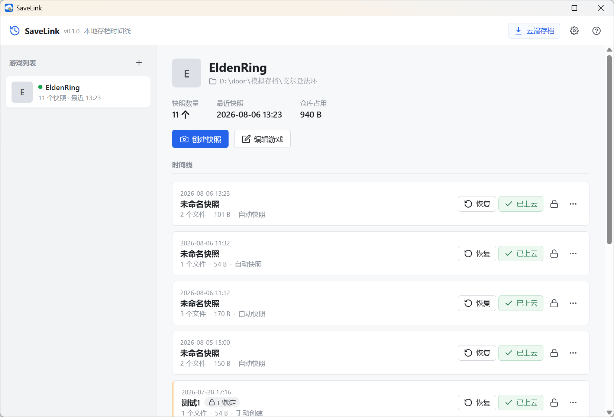
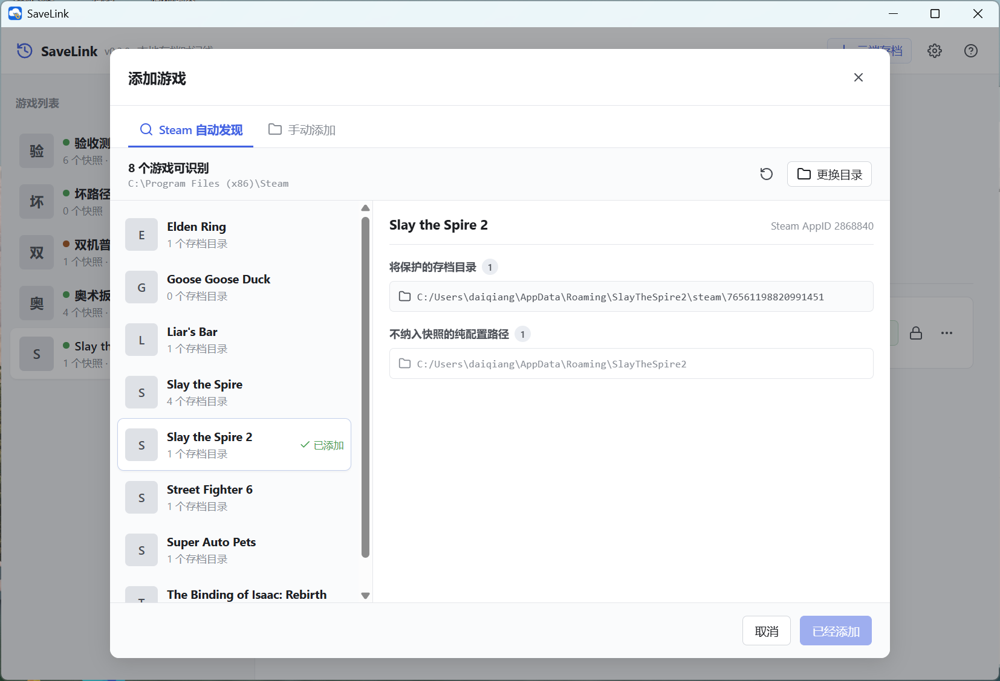

# README.MD

## 为什么我会做SaveLink

曾经有这样的场景，让我很想有一个便捷的云存档工具：

1. 玩某些不支持云存档的单机游戏，因为没有云存档，始终有一种不踏实感。想要备份存档只能手动备份，然后再手动上传到云盘上，非常麻烦。
2. 会身处两地玩游戏，比如在公司玩游戏，同一份存档，回到家还想接着玩
3. 某些游戏只有一个存档位，一旦死档、误操作、关键选择错误，就很难回到昨天或某个关键节点
4. 一开始玩某些不支持云存档的单机游戏，通关后便卸载了。一年后游戏更新了DLC，但之前的存档已经没有了
5. 在PC上玩模拟器游戏，没有云存档
6. 某些游戏，有小概率存档损坏无法还原，如《杀戮尖塔2》的bug导致存档完全丢失

我在网上没有找到任何一款工具能完全满足上述需求。有些工具使用起来很方便、但是收费。有些工具免费，但是提供的存储空间又很小。有些工具只支持正版游戏。有些工具使用起来又非常麻烦。总之都有自身的问题。基于这样的现状。我才有了做这个小工具的想法，希望覆盖上述需求，同时不收费，存储量大，使用方便。

## SaveLink简介

SaveLink是一款基于windows的游戏存档工具，同时满足存储空间大、数据安全、操作方便3个特点。SaveLink 不提供中转存储服务器，存档直接保存在用户自己的百度网盘中（后续也有可能会加入其他网盘），所以不存在存储不够这样的情况。通常情况下，百度网盘都是2T打底，对于普通的游戏存档来说，2T的空间绰绰有余了。

## 下载

前往 [GitHub Releases](https://github.com/daiqiang/save_link/releases) 下载最新版本。当前版本为 [v0.4.0](https://github.com/daiqiang/save_link/releases/tag/v0.4.0)。

## 快速开始

1. 下载压缩包，解压后双击exe就可以使用了。
2. 添加游戏时，SaveLink 会自动扫描 Steam 游戏及其存档目录，也可以选择 DeSmuME 模拟器；未识别到的游戏仍可手动添加。
3. 存档可以上传到网盘，首次上传时，默认浏览器会打开百度授权页面。
4. 用户手动上传过一次之后，后续存档会自动上传到百度网盘，每个游戏30个自动存档位，满了之后会自动删除最早的存档。可以手动锁定存档，锁定后存档不会自动清除。锁定后的存档不占用这30个自动存档位，可锁定的存档位没有上限。
5. 在新电脑需要同步存档时，打开云端存档、下载快照、绑定本机目录、恢复。

## 页面截图

### 首页截图

### 添加游戏：Steam 自动发现

## v0.4.0 更新

- 支持 DeSmuME 0.9.x，可扫描 ROM 并自动找到对应的 `.dsv` 游戏内存档。
- 只备份目标游戏的 `.dsv`，不会上传 ROM，也不会影响其他游戏存档或即时存档。
- 使用 ROM SHA-256 识别同一游戏，支持 ROM 改名后继续匹配和跨设备重新绑定。

## License

SaveLink 源代码采用 [Apache License 2.0](LICENSE)
